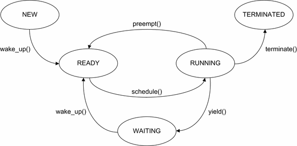
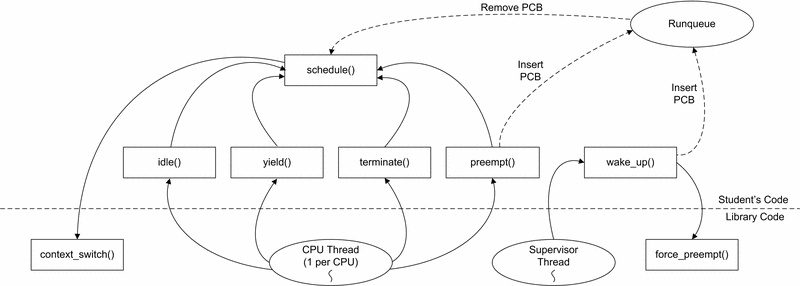

| Scheduling Algorithms<br>Ch5-8.4 | S21 CSCI460 Operating Systems  |
| :--- | :--- |
| Assigned: **2021-03-18** | Due Date: **See Parts** | 
| Abstract: | Develop an operating system scheduler using FCFS, RR, Priority schedulers. |
| Objectives: | 1. FCFS, SKF, RR Scheduler Algorithms<br> 2. Binary, County, and Coniditonal Mutexes <br> 3. Analysis of Scheduling Algorithms|
| Grading: 45 pts| A (&ge;41.85); A- (&ge;40.50); <br> B+ (&ge;39.15); B (&ge;37.35); B- (&ge;36.00) <br> C+ (&ge;34.65); C (&ge;32.85); C- (&ge;31.75) <br> D+ (&ge;30.15); D (&ge;28.35); D- (&ge;27) |
| Outcomes: | R8 (CS: 5-1, 2, 5-a-4; SE: 1, III-1-2-1) <br> (see syllabus for description of course outcomes)|

## Project Description:

Explore the differences in scheduling algorithms and code the different CPU schedulers in a simulator that produces tasks to be scheduled on some number of processors. The schedule for the completion of this project is in parts as follows:

### Project  Schedule

- Part-0: (Due: **2021-04-01**) Clone, build, and explore the code provided. Implement the FCFS Scheduler.
- Part-1: (Due: **2021-04-08**) Implement the Round-Robin Scheduler.
- Part-2: (Due: **2021-04-15**) Implement the Static Priority Scheduler.

This project is designed to provide you practical experience working with _critical section_ code blocks - represented as data structures and operations on these data structures - and synchronize multiple threads to avoid _race conditions_, as well as provide you the opportunity to write CPU schedulers. 

In this project, you will implement the scheduler for a multiprocessor operating system simulator using pthreads. The framework for this multithreaded OS simulator is nearly complete, but missing its CPU scheduler. Your main task is to implement a CPU scheduler for the OS simulator. You will do so using three (3) different scheduling algorithms we have discussed in class and covered in your text.

You have been provided source files providing the framework for the OS simulator. You will only need to modify the `student.c` file to implement the CPU scheduler algorithms, but as always, you should review the other files provided for insight as to how the simulator works and functions and will call your code. A large number of code comments have been provided to help give you guidance where possible and appropriate. 

The following files have been provided:  
> `Makefile` used to build your solution; modify if needed.  
   `os-sim.c` code for the operating system simulator which calls your CPU scheduler  
   `os-sim.h` header file for the OS simulator.  
   `process.c` descriptions of the process data that is to be scheduled  
   `process.h` header file for the process data  
   `sutdent.c` edit to implement your scheduler; contains stub functions for your CPU scheduler  
   `studemt.h` header file for your code to interface with the OS simulator

### Scheduling Algorithms

- First Come First Served  
   Runnable processes are kept in a first-in, first-out ready queue. FCFS is non-preemptive; once a process begins running on a CPU, it will continue running until it either completes or blocks for I/O.

- Round Robin  
   Similar to FCFS, except preemptive. Each process is assigned a timeslice when it is scheduled. At the end of the timeslice, if the process is still running, the process is preempted, and moved to the tail of the ready queue.

- Static Priority  
   The processes with the highest priorities always get the CPU. Lower priority processes may be preempted if a process with a higher priority becomes runnable. 

### Process State

In the OS simulator, there are five (5) possible states for a process, which are listed in the `process_state_t enum` data structure in the file `os-sim.h`:

> `NEW` The process is being created, and has not yet begun executing.  
  `READY` The process is ready to execute, and is waiting to be scheduled on a CPU.  
  `RUNNING` The process is currently executing on a CPU.  
  `WAITING` The process has temporarily stopped executing, and is waiting on an I/O request to complete.  
  `TERMINATED` The process has completed. 



There is a field named `state` in the PCB data structure, which must be updated with the current state of the process. The simulator will use this field to collect statistics. 

### Manipulating Queues

On most systems, there are a large number of processes, but only one or two (2) CPUs on which to execute them. When there are more processes ready to execute than CPUs, processes must wait in a READY state until a CPU becomes available. To keep track of the processes waiting to execute, we keep a ready queue of the processes in the READY state. 

Since the ready queue is accessed by multiple processors, which may add and remove processes from the ready queue, the ready queue must be protected by some form of synchronization - for this project, it will be a mutex lock.

The different scheduling algorithms will require this ready queue to be a standard queue as well as a priority queue. As a result, you have been provided a C-language based queue that can act as both a regular queue and a priority queue in the files `readyQueue.c` and `readyQueue.h` as well as a test program of the queue in `test.c`. You may use this implementation or create your own. 

### Scheduling Process

`schedule()` is the core function of the CPU scheduler. It is invoked whenever a CPU becomes available for running a process. `schedule()` must search the ready queue, select a runnable process, and call the `context_switch()` function to switch the process onto the CPU.

There is a special process, the _idle_ process, which is scheduled whenever there are no processes in the READY state. 

### CPU Scheduler Invocation

There are four (4) events which will cause the simulator to invoke `scheduler()`:  
> `yield()` - a process completes its CPU burst and yields the processor to perform an I/O burst.   
   `wake_up()` - a process that previously yielded completes its I/O burst, and is ready to perform CPU operations.  
   `preempt()` - when using a round-robin or state priority scheduling algorithm, a CPU-bound process may be preempted before it completes its CPU operations.  
   `terminate()` - a process exists or is killed.

The CPU scheduler also contains one other important function - `idle(). This function contains the code that gets by the idle process. In the real world, the idle process puts the processor in a low-power mode and waits. For our OS simulator, you will use a _pthread conditional variable_ to block until a process enters the ready queue. 

### The Simulator

Pthreads will be used to simulate an operating system on a multiprocessor computer. The simulator will use one thread per CPU and one thread as a supervisor for the simulator itself. The CPU threads will simulate the currently-running processes on each CPU, and the supervisor thread will print output and dispatch events to the CPU threads. 

Since the code you write will be called from multiple threads, the CPU scheduler must be thread-safe. This means that all data structures you use, including your ready queue, must be protected using mutexes. 

The number of CPUs is specified as a command-line parameter to the simulator. For this project, experiments will be performed with 1, 2, and 4 CPUs.

For demonstration purposes, the simulator executes much slower than a real system. In the real world, a CPU burst might range from one to a few hundred milliseconds, whereas the simulator will range from 0.2 to 2.0 seconds. 



### Sample Output

Compile and run the simulator with `./os-sim 2`. After a few seconds, hit Control-C to exit. You will see output similar to below:  

    Time  Ru Re Wa      CPU 0    CPU 1        < I/O Queue <  
    ===== == == ==      ======== ========     =============
    0.0   0  0  0       (IDLE)   (IDLE)        < < 
    0.1   0  0  0       (IDLE)   (IDLE)        < < 
    0.2   0  0  0       (IDLE)   (IDLE)        < <
    0.3   0  0  0       (IDLE)   (IDLE)        < <
    0.4   0  0  0       (IDLE)   (IDLE)        < <
    0.5   0  0  0       (IDLE)   (IDLE)        < <
    0.6   0  0  0       (IDLE)   (IDLE)        < <
    0.7   0  0  0       (IDLE)   (IDLE)        < <
    0.8   0  0  0       (IDLE)   (IDLE)        < <
    0.9   0  0  0       (IDLE)   (IDLE)        < <
    1.0   0  0  0       (IDLE)   (IDLE)        < <

The simulator generates a Gantt Chart, showing the current state of the OS every 100ms. The leftmost column shows the time, in seconds. The next three (3) columns show the number of running, ready, and waiting processes, respectively. The next two columns show the process currently running on each CPU. The rightmost column shows the processes which are currently in the I/O queue, with the head of the queue on the left, and the tail on the right. 

As you can see, nothing is executing. This is because there is not CPU scheduler to select processes to dispatch. Once you have completed Part-0 and implemented a  basic FCFS scheduler, you will see the processes executing on the CPUs.

### Test Processes 

For this simulation, a series of test processes will be used; five (5) CPU-bound; three (3) I/O-bound. For simplicity, they have been labeled starting with a "C" or an "I" to indicate CPU-bound or I/O-bound respectively.

|PID|Process Name | CPU or I/O Bound | Priority | Start Time | 
|---|-------------|------------------|----------|------------|
| 0 | Iapache     | I/O-bound        | 8        | 0.0 s      |
| 1 | Ibash       | I/O-bound        | 7        | 1.0 s      |
| 2 | Imozilla    | I/O-bound        | 7        | 2.0 s      |
| 3 | Ccpu        | CPU-bound        | 5        | 3.0 s      |
| 4 | Cgcc        | CPU-bound        | 1        | 4.0 s      |
| 5 | Cspice      | CPU-bound        | 2        | 5.0 s      |
| 6 | Cmysql      | CPU-bound        | 3        | 6.0 s      |
| 7 | Csim        | CPU-bound        | 4        | 7.0 s      |


## Lab Environment

   The lab environment will take place on the virtual machine (VM) `csdept11.cs.mtech.edu`. You may ssh into this machine using your normal Department Linux login and password. 

   Upon logging into the VM, you will be presented your unique `port number` for connection to a VNC session when using the `qemu` emulation software. Remember this port. If you forget the port number, you may type the command `myport` to be presented your port number again. This is the port you will need to use to access emulated OS activities, both internally - from the Campus networks - and externally - from your home or off-campus networks. 

## Specific Project Tasks:

The following tasks should be completed to obtain the maximum points available for this assignment.

1. Obtaining your project files  
   1. Perform the following tasks on the Department GitLab Server:  
      1. Login to the Department GitLab server [gitlab.cs.mtech.edu](https://gitlab.cs.mtech.edu) with your email address and your password. 
      1. Select the project operating-systems/s21-csci460/scheduler> from the offering of this course.
      1. Click on the __fork__ button to create a copy of this project under your own GitLab account.
      1. Go to the __project settings__ menu and then the __members__ option and add your instructor and any teaching assistants as developers to your fork of the project. 
      1. Lastly, go back to this project under your account and click the icon to the right of the project URL. This will copy the project URL to the clipboard so you may paste it in the next sequence of steps. 
   1. Perform the following tasks on the Department Linux server `csdept11.cs.mtech.edu`. 
      1. Login to the Department's Linux server with your credentials. 
      1. Execute the command(s) 
      ```
      cd ~/CSCI460/Projects
      ```
      3. Execute the command `git clone <url>`, where `<url>` is pasted from the clipboard.
      1. Change into the directory created by the `git clone` command to perform the rest of the tasks for this project. 

1. Part-0 (25 Pts): FCSC Scheduler 

   Explore the provided code and _Makefile_ that is used to build two different _targets_: __os-sim__ and __testReadyQueue__. The `os-sim` is the os simulator and must be provided at least the number of CPUs to simulate, but optionally will take the specific scheduling algorithm to use.    

   1. Use the provided `queue` or implement your own to be used as the ready queue. 

   1. Implement the `yield()`, `wake_up()`, and `terminate()` handlers.

   1. Implement `idle()`; must wait on a conditional variable that is signaled whenever a process is added to the ready queue. 

   1. Implement `schedule()`; should extract the first process from the ready queue, then call `context_switch()` to select the process to execute. If there are no runnable processes, `context_switch()` should be called with a `null` pointer as the PCB to execute the idle process. 

   1. Be sure to update the PCB state field. The simulator will use this field to generate the running, ready, waiting columns, and to generate statistics at the end of the simulation.

   1. There is a field in the PCB, `next`, which you may use to build linked lists of PCBs.

   1. Four of the five entry points into the schedule should cause a new process to be scheduled on the CPU. In your handlers, be sure to call `schedule()`, which will select a runnable process and then call `context_switch()`. When these four functions return, the simulator will simulate executing the process selected by `context_switch()`.

   1. `context_switch()` takes a timeslice parameter, which is used for preemptive scheduling. Since FCFS is non-preemptive, use `-1` for this parameter to give the process an infinite timeslice. 

   1. Run your OS simulator with 1, 2, and 4 CPUs. Compare the total execution time of each. Is there a linear relationship between the number of CPUs and the total execution time? Why or why not?

Once you have completed your FCFS scheduler, testing your code using `./os-sim 1` will generate output similar to the following:   

    Time  Ru Re Wa      CPU 0         I/O Queue 
    ===== == == ==      ========     =============
    0.0   0  0  0       (IDLE)       < <
    0.1   1  0  0       Iapache      < <
    0.2   1  0  0       Iapache      < <
    0.3   1  0  0       Iapache      < <
    0.4   0  0  1       (IDLE)       < Iapache <
    0.5   0  0  1       (IDLE)       < Iapache <
    0.6   1  0  0       Iapache      < <
    0.7   1  0  0       Iapache      < <
    0.8   1  0  0       Iapache      < <
    0.9   1  0  0       Iapache      < <
    1.0   0  0  1       (IDLE)       < Iapache <
    1.1   1  0  1       Ibash        < Iapache <
    1.2   1  0  1       Ibash        < Iapache <
    1.3   1  0  1       Ibash        < Iapache <
    1.4   1  0  1       Ibash        < Iapache <
    1.5   1  0  1       Iapache      < Ibash <
    1.6   1  0  1       Iapache      < Ibash <
    1.7   0  0  2       (IDLE)       < Ibash Iapache <
    1.8   0  0  2       (IDLE)       < Ibash Iapache <
    1.9   0  0  2       (IDLE)       < Ibash Iapache <
    2.0   1  0  1       Ibash        < Iapache <
    ....
    66.9  1  1  0       Ibash        < <
    67.0  1  1  0       Ibash        < <
    67.1  1  1  0       Ibash        < <
    67.2  1  0  0       Imozilla     < <
    67.3  1  0  0       Imozilla     < <
    67.4  1  0  0       Imozilla     < <
    67.5  1  0  0       Imozilla     < <

    # of Context Switches: 97
    Total execution time: 67.6 s
    Total time spent in READY state: 389.9 s

3. Part-1 (10 pts): Round Robin Scheduler 

   Add Round-Robin scheduling functionality to your code. 
   
   1. Modify `main()` to add a command line option, `-r`, which selects the Round-Robin scheduling algorithm, and accepts a parameter, the length of the timeslice. 
   
      For this project, timeslices are measured in tenths of seconds. E.g.: `./os-sim <# CPUs> -r 5` should run the round-robin scheduler with 500 ms timeslice. While, `./os-sim <# CPUs>` should continue to run the FCFS scheduler.

   1. Implement the `preempt()` handler. 

   1. To specify a timeslice when scheduling a process, use the timeslice parameter of `context_switch()`. The simulator will automatically preempt the process and call your `preempt()` handler if the process executes on the CPU for the length of the timeslice without terminating or yielding for I/O.

   1. Run your Round-Robin scheduler with timeslices of 800ms, 600ms, 400ms, and 200ms, using only one CPU for your tests. 
   
   1. Compare the statistics at the end of the simulation. Show that the total waiting time decreases with shorter timeslices. However, in a real OS, the shortest timeslice possible is usually not the best choice. Why not?

4. Part-2 (10 pts): Static Priority Scheduling

   Add Static Priority scheduling to your code. 
   
   1. Modify `main()` to accept the `-p` parameter to select the Static Priority algorithm. The command line option, `-r`, should still select the round-robin scheduling algorithm, and default FCFS scheduler should continue to work if the command line is only provided the number of CPUs. It is an error to provide both the `-r` and the `-p` flag, or any illegal combination of command line parameters and your program should exit after displaying the correct possible invocation methods. 

   1. You need to implement a `priority queue` (or make use of the `queue` provided) so that is uses the priority specified in the `static_priority` field of the PCB. This priority is a value from 0 to 10, with 0 being the lowest priority and 10 being the highest priority.

   1. Make use of the `current[]` array and `force_preempt()` function. The `current[]` array should be used to keep track of the processes currently executing on each CPU. Since this array is accessed by multiple CPU threads, it must be protected by a mutex. `current_mutex` has been provided for this purpose.

   1. The `force_preempt()` function preempts a running process before its timeslice expires. Your `wake_up()` handler should make use of this function to preempt a lower priority process when a higher priority process needs a CPU.

   1. Run each of your three scheduling algorithms (using one CPU), and compare the total waiting times. Which algorithm is the closest approximation of SJF? Why?

## Project Grading: 

The project must compile without error (ideally without warnings) and should not fault upon execution. All exceptions should be caught if thrown and handled in a rational manner. Grading will follow the *project grading rubric* shown below: 

| Attribute (Pts) | Exceptional (1) | Acceptable (0.8) | Amateur (0.7) | Unsatisfactory (0.6) | 
| :---:           | :---            | :---             | :---          | :---                 |
| Specification (10) | The program works and meets all of the specifications. | The program works and produces correct results and displays them correctly. It also meets most of the other specifications. | The program produces correct results, but does not display them correctly. | The program produces incorrect results. |
| Readability (10) | The code is exceptionally well organized and very easy to follow. | The code is fairly easy to read. | The code is readable only by someone who knows what it is supposed to be doing. | The code is poorly organized and very difficult to read. | 
| Reusability (10) | The code only could be reused as a whole or each routine could be reused. | Most of the code could be reused in other programs. | Some parts of the code could be reused in other programs. | The code is not organized for reusability. | 
| Documentation (10) | The documentation is well written and clearly explains what the code is accomplishing and how. | The documentation consists of embedded comments and some simple header documentation that is somewhat useful in understanding the code. | The documentation is simply comments embedded in the code with some simple header comments separating routines. | The documentation is simply comments embedded in the code and does not help the reader understand the code. | 
| Efficiency (5) | The code is extremely efficient without sacrificing readability and understanding. | The code is fairly efficient without sacrificing readability and understanding. | The code is brute force and unnecessarily long. | The cod eis huge and appears to be patched together. | 
| Delivery (total) | The program was delivered on-time. | The program was delivered within a week of the due date | The program was delivered within 2-weeks of the due date. | The code was more than 2-weeks overdue. | 

### Example: 

The *delivery* attribute weights will be applied to the total score from the other attributes. If a project scores 36 points total for the sum of *specification*, *readability*, *reusability*, *documentation*, and *efficiency* attributes, but was turned in within 2-weeks after the due date, the project score would be $`36\cdot 0.7 = 25.2`$. 

## Collaboration Opportunities: 

This project provides *no collaboration opportunities* for the students. Students are expected to design and implement an original solution specific in this project description. Any work used that is not original should be cited and properly references in both the code and in any accompanying write-up. Failure to cite code that is not original may lead to claims of academic dishonesty against the student - if in doubt of when to cite, see your instructor for clarification. 


  
